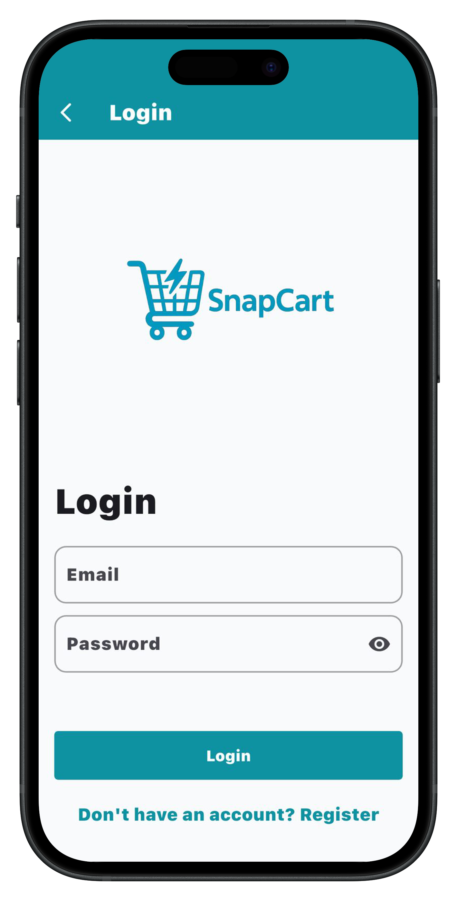
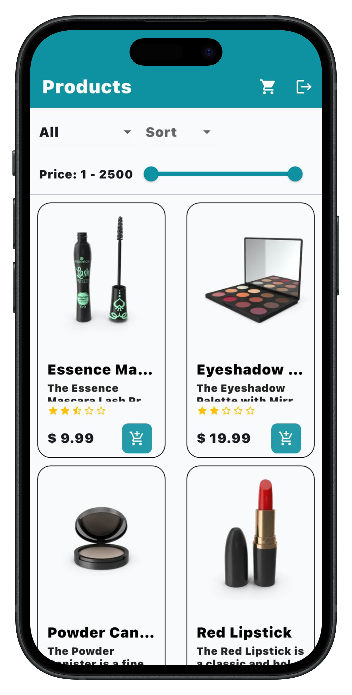
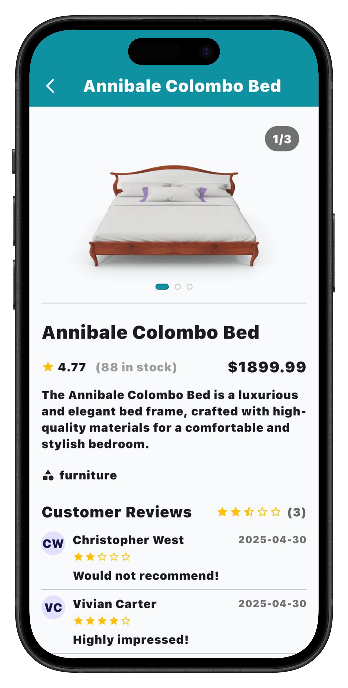
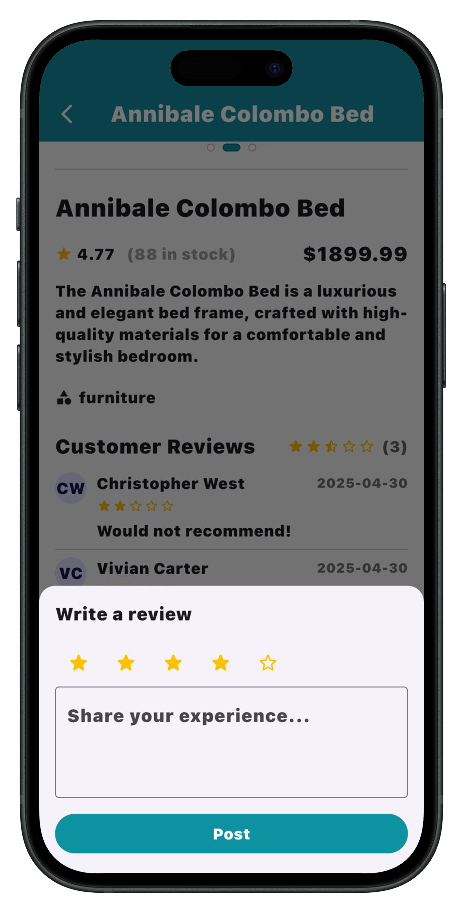
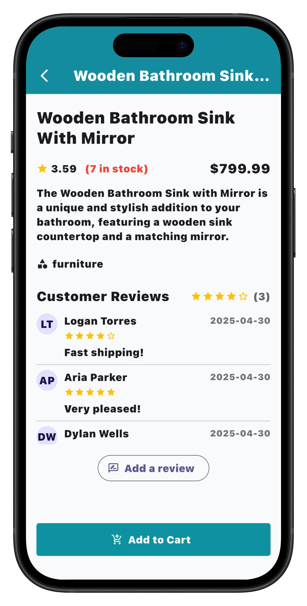
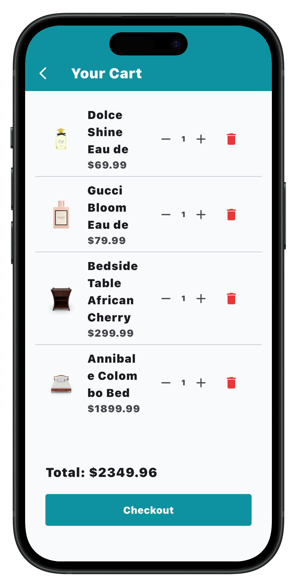

# product_list_app

Developed a fully functional e-commerce application using Flutter, BLoC/Cubit, and Firebase Authentication. The app fetches real product data from the DummyJSON API, allowing users to browse, filter, and sort products by category or price. Implemented complete cart functionality, including adding, removing, and updating product quantities with real-time total price calculation and input validation. Guest users can explore products and add items to their cart, while checkout requires authentication through Firebase. Designed a clean and responsive UI/UX with smooth navigation, proper loading/error states, and toast notifications for user actions. This project highlights strong skills in state management, API integration, and scalable Flutter architecture

  
  
  
  
  
  

- [Lab: Write your first Flutter app](https://docs.flutter.dev/get-started/codelab)
- [Cookbook: Useful Flutter samples](https://docs.flutter.dev/cookbook)

For help getting started with Flutter development, view the
[online documentation](https://docs.flutter.dev/), which offers tutorials,
samples, guidance on mobile development, and a full API reference.
